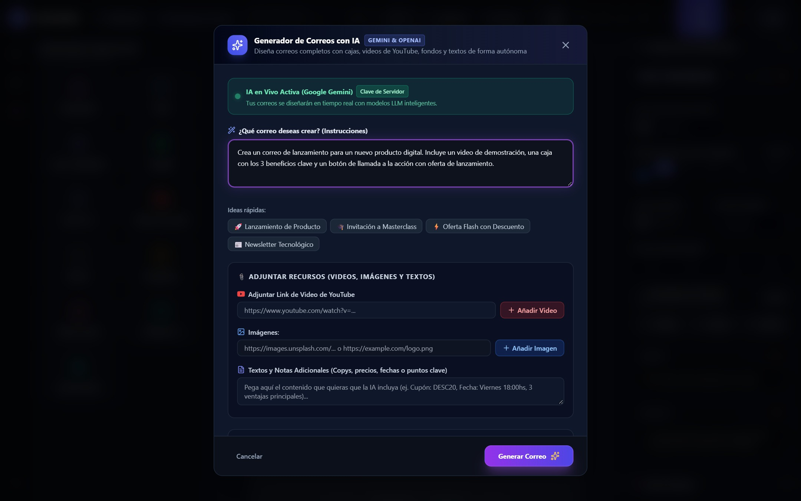

# ✉️ PrettierMails — Enterprise Visual Email Studio & Automation Suite

<div align="center">


<p align="center">
  <strong>Plataforma integral de diseño visual de correos electrónicos profesionales, marketing masivo, automatizaciones y despacho multicanal con superpoderes de Inteligencia Artificial.</strong>
  <br />
  Arquitectura de dos pantallas (Dashboard y Studio), soporte nativo para videos de YouTube, tarjetas Callout no planas, tablas cebra, inlining CSS con Juice, compilador dual MJML, espacios de trabajo multi-inquilino, gestor multi-cuenta SMTP con cifrado AES-256-GCM, importador CSV, campañas masivas con tracking de aperturas/clics, secuencias automatizadas y webhooks firmados con HMAC.
</p>

[](https://react.dev/)
[](https://vitejs.dev/)
[](https://tailwindcss.com/)
[](https://nodejs.org/)
[](https://expressjs.com/)
[](https://www.apachefriends.org/)
[](https://ai.google.dev/)
[](https://openai.com/)
[](tests)
[](LICENSE)

</div>

---

## 🌟 ¿Qué es PrettierMails?

**PrettierMails** es una suite moderna de maquetación, automatización y marketing por correo electrónico diseñada para erradicar las arcaicas tablas HTML manuales y las complejidades de maquetar correos para clientes de email tradicionales.

Inspirado en la elegancia visual y fluidez de plataformas de clase mundial (*Linear, Apple, Stripe y Notion*), PrettierMails combina la potencia de un editor visual modular sin código con una infraestructura empresarial completa en el backend:

1. **Dashboard Central de Control**: Administra tus borradores, explora el catálogo de plantillas oficiales, supervisa campañas, cambia de espacio de trabajo y visualiza el estado de sincronización en la nube en tiempo real.
2. **Studio Editor Visual**: Entorno interactivo WYSIWYG con catálogo de componentes modulares arrastrables, simulador responsivo Desktop/Móvil (375px), historial de versiones y panel inspector de estilos y contenidos.
3. **Suite Empresarial de Marketing**: Despacho de campañas masivas por lotes, seguimiento en tiempo real de aperturas y clics, automatizaciones visuales (drip campaigns), importador masivo de listas de contactos CSV y gestor multi-cuenta SMTP.

---

## 📸 Galería Visual de la WebApp

> *Todas las capturas y animaciones a continuación fueron tomadas directamente desde la aplicación web en funcionamiento real.*

### 1. Dashboard de Correos y Borradores (Menú Inicial)
<div align="center">
  
  <p><em>Menú central con selector de espacio de trabajo, tarjetas de acceso rápido, buscador en vivo y tabla de plantillas.</em></p>
</div>

### 2. Studio Editor con Plantilla "Lanzamiento con Video de YouTube"
<div align="center">
  
  <p><em>Entorno de maquetación en vivo: biblioteca modular a la izquierda, lienzo central interactivo y panel inspector a la derecha.</em></p>
</div>

### 3. Editor de Contenedor Callout con Contenido Anidado
<div align="center">
  
  <p><em>Control total sobre tarjetas Callout: bordes laterales de acento, sombras suaves y elementos interiores (títulos, textos y botones CTA).</em></p>
</div>

### 4. Simulador Responsivo Móvil (375px)
<div align="center">
  
  <p><em>Conmutación instantánea a la vista móvil para verificar legibilidad, espaciados y comportamiento en smartphones.</em></p>
</div>

### 5. Asistente con Inteligencia Artificial (Google Gemini 3.6 Flash & OpenAI)
<div align="center">
  
  <p><em>Generación autónoma con indicador en tiempo real de motor activo, soporte para Google Gemini 3.6 Flash y adjunción multimedia.</em></p>
</div>

### 6. Campañas de Email Masivo y Analítica de Despacho
<div align="center">
  
  <p><em>Gestión de campañas de correo masivo con métricas de entrega, tasas de apertura (Open Rate) y clics en enlaces en tiempo real.</em></p>
</div>

### 7. Automatizaciones de Marketing y Webhooks Firmados
<div align="center">
  
  <p><em>Secuencias automatizadas por disparadores (contact_added), delays configurables y webhooks firmados con HMAC-SHA256.</em></p>
</div>

### 8. Gestor Multi-Cuenta SMTP con Cifrado AES-256-GCM
<div align="center">
  
  <p><em>Múltiples servidores SMTP por espacio de trabajo con credenciales cifradas con AES-256-GCM, límites diarios y prueba de handshake.</em></p>
</div>

---

## 🚀 Características Principales y Novedades

### 🤖 1. Generador de Correos con IA de Última Generación
- **Modelos Oficiales de Google Gemini**: Integración nativa con `gemini-3.6-flash` (Recomendado oficial de Google), `gemini-3.5-flash` y `gemini-3.5-flash-lite`, además de soporte para OpenAI `gpt-4o-mini`.
- **Indicador Dinámico de Motor en Tiempo Real**:
  - `🟢 IA en Vivo Activa (Google Gemini / OpenAI)`: Detecta automáticamente si existe una clave en `server/.env` o en la memoria del navegador.
  - `🟡 Motor de Respaldo Local (Modo Offline)`: Notifica al usuario de forma transparente si no hay clave activa y utiliza un motor sintético estructurado para no interrumpir el flujo de trabajo.
- **Detección Automática de Multimedia**: Extrae enlaces de YouTube e imágenes directamente desde las instrucciones del usuario y los convierte en bloques nativos de correo.
- **Diseños Modernos y No Planos**: Generación guiada por directrices de jerarquía visual con tarjetas Callout, bordes de acento lateral y botones elevados.

### 🏢 2. Multi-Tenancy y Espacios de Trabajo (Workspaces)
- **Aislamiento Multi-Inquilino**: Cada espacio de trabajo separa de forma segura sus plantillas, contactos, campañas, cuentas SMTP, webhooks y registros de auditoría.
- **Control de Acceso Basado en Roles (RBAC)**: Roles de usuario granulares (`owner`, `admin`, `editor`, `viewer`) con validación estricta de permisos en el backend.
- **Conmutador Rápido**: Cambia de espacio de trabajo con un solo clic desde la barra de navegación superior.

### 🔐 3. Gestor Multi-Cuenta SMTP con Cifrado AES-256-GCM
- **Seguridad Criptográfica**: Las contraseñas SMTP se almacenan en la base de datos cifradas mediante **AES-256-GCM** con clave secreta de aplicación y vector de inicialización único (IV).
- **Enmascaramiento en Listados**: Las credenciales nunca se exponen al cliente, mostrándose siempre enmascaradas (`••••••••`).
- **Límites de Envío y Contadores**: Configuración de cupo máximo diario (`daily_limit`) por cuenta para prevenir bloqueos de reputación.
- **Prueba de Handshake en Vivo**: Botón de verificación instantánea para validar host, puerto, autenticación y TLS antes de realizar envíos.

### 📋 4. Audiencias, Listas de Contactos e Importador CSV
- **Gestión de Contactos**: Administra listas de suscriptores con campos personalizados (`first_name`, `last_name`, `company`, `phone`, etc.).
- **Importador CSV Inteligente**: Carga masiva de archivos `.csv` con mapeo automático de columnas, normalización de datos y deduplicación por correo.
- **Motor de Interpolación Dinámica**: Personaliza tus correos en el lienzo y en envíos masivos utilizando etiquetas tipo bigote: `{{first_name}}`, `{{company}}`, `{{corporate_email}}`.

### 📈 5. Campañas de Email Masivo y Analítica de Despacho
- **Cola de Despacho Asíncrona**: Envía correos masivos personalizados individualmente a cada destinatario sin exponer las direcciones en copia (BCC).
- **Seguimiento en Tiempo Real**:
  - Píxel invisible de 1x1 (`/api/track/open/:dispatchId`) para contabilizar aperturas únicas y totales.
  - Redirección transparente (`/api/track/click/:dispatchId`) para auditar clics en botones y enlaces.
  - Registro de User-Agent, fecha/hora e IP del destinatario con filtrado básico de bots.
- **Control Operacional**: Pausa, reanuda o inspecciona las estadísticas de entrega de cualquier campaña en ejecución.

### ⚡ 6. Automatizaciones Visuales (Drip Campaigns) y Webhooks
- **Secuencias Automatizadas**: Diseña flujos automáticos activados por eventos (ej. cuando se añade un contacto a una lista).
- **Pasos Temporizados**: Configura esperas y retrasos (delays) entre pasos antes de despachar el siguiente correo de la secuencia.
- **Motor de Webhooks con Firma Criptográfica**: Notifica a tus sistemas externos ante eventos clave (`email_opened`, `link_clicked`, `campaign_completed`) con firma `X-PrettierMails-Signature` generada mediante **HMAC-SHA256**.
- **Historial de Entregas y Reintentos**: Bitácora detallada de entregas HTTP con código de respuesta y reintentos con retroceso exponencial.

### 🛡️ 7. Auditoría Operacional y Seguridad Integral
- **Registro Inmutable de Auditoría (`audit_logs`)**: Supervisa cada acción crítica realizada en el sistema (inicios de sesión, guardado de plantillas, configuración SMTP, despacho de campañas).
- **Protección Antifraude SSRF (Server-Side Request Forgery)**: Filtro estricto que rechaza llamadas del compilador a direcciones IP internas o metadatos de nube (`127.0.0.1`, `10.0.0.0/8`, `169.254.169.254`, etc.).
- **Bloqueo Concurrente de Plantillas (`template_locks`)**: Evita que dos usuarios en un mismo espacio de trabajo sobreescriban accidentalmente el trabajo del otro.
- **Rate Limiters Dedicados**: Límites de tasa independientes para prevención de abusos en envíos masivos, verificación SMTP y generación con IA.

### 🗄️ 8. Base de Datos Híbrida (MySQL en XAMPP / MariaDB / Postgres / Memory)
- **Soporte Nativo para XAMPP MySQL**: Diseñado para conectarse sin fricción a MySQL local (`localhost:3306`, base de datos `prettier_mails`).
- **19 Tablas Relacionales Migradas Automáticamente**: Al arrancar el servidor, ejecuta automáticamente migraciones idempotentes y sembradores (seeders) iniciales.
- **Respaldo en Memoria Transparente**: Si el servicio de base de datos no está corriendo, el sistema conmuta automáticamente a un repositorio en memoria para que puedas maquetar y probar sin interrupciones.

### 📐 9. Compilador Dual MJML y Tablas HTML con Inlining Juice
- **Compatibilidad Extrema**: Produce HTML limpio basado en tablas anidadas con estilos inline procesados por Juice, garantizando perfecta visualización en Gmail, Apple Mail, Outlook (Windows y Mac), Yahoo Mail y clientes móviles.
- **Exportación / Importación Round-Trip**: Descarga tus correos como archivos `.html` independientes con metadatos JSON invisibles que puedes volver a abrir en PrettierMails en cualquier momento.

---

## 🧩 Catálogo de Componentes Modulares

PrettierMails ofrece una biblioteca de bloques modulares listos para arrastrar y soltar:

| Componente | Descripción | Opciones Principales |
|---|---|---|
| **Video de YouTube** | Tarjeta de video con miniatura HD oficial y botón de reproducción | Extracción automática de ID, sinopsis, botón CTA personalizable, vista previa interactiva |
| **Caja / Callout** | Contenedor elevado con contenido anidado editable | Bordes de acento lateral (`borderLeftColor`), fondo, esquinas curvas y elementos hijos (títulos, párrafos, botones) |
| **Grid / 2 Columnas** | Diagramación de 2 columnas para imágenes y texto | Proporciones ajustables (30/70, 50/50, 70/30, 25/75), alineación vertical |
| **Tabla Estilizada** | Tablas de datos, credenciales o listas de precios | Filas cebra alternadas, temas (Slate, Azul Pro, Esmeralda), columnas dinámicas |
| **Encabezado (H1/H2)** | Títulos principales e insignias (eyebrows) | Tamaños tipográficos (`12px` - `36px`), alineación, peso y paleta de colores |
| **Párrafo de Texto** | Textos y bloques narrativos | Formato `**negrita**`, variables dinámicas `{{variable}}` y saltos de línea |
| **Imagen** | Banners, logos y fotografías | Ancho porcentual, ancho máximo en píxeles, enlaces URL de destino |
| **Botón CTA** | Botón de llamada a la acción de alto contraste | Radio de borde (recto, curvo, píldora), padding X/Y, sombras suaves y colores |
| **Redes Sociales** | Barra de iconos sociales | YouTube, Instagram, X/Twitter, GitHub, LinkedIn, Facebook |
| **Línea Divisoria** | Separadores visuales horizontales | Estilos continuo, discontinuo o punteado, grosor y color |
| **Espaciador** | Control de ritmo vertical entre secciones | Alturas predefinidas (`12px`, `24px`, `36px`, `48px`) |

---

## 🛠️ Instalación y Puesta en Marcha

### Prerrequisitos
- [Node.js](https://nodejs.org/) v18.0.0 o superior
- [XAMPP](https://www.apachefriends.org/) (para MySQL local) o cualquier servidor MySQL / MariaDB / PostgreSQL
- Administrador de paquetes `npm`

### 1. Clonar el Repositorio
```bash
git clone https://github.com/Igfri-dev/PrettierMails.git
cd PrettierMails
```

### 2. Instalar Dependencias
Instala todas las dependencias del proyecto (raíz, cliente y servidor) en un solo comando:
```bash
npm run install:all
```

### 3. Configurar la Base de Datos (XAMPP MySQL)
1. Inicia el módulo **MySQL** desde el Panel de Control de XAMPP.
2. Abre [phpMyAdmin](http://localhost/phpmyadmin) y crea una base de datos llamada `prettier_mails` con cotejamiento `utf8mb4_unicode_ci`.
3. Edita o crea tu archivo `server/.env` tomando como base `server/.env.example`:

```env
PORT=3001
CLIENT_ORIGIN=http://localhost:5173

# Base de Datos (XAMPP MySQL)
DB_ENGINE=mysql
DB_HOST=localhost
DB_PORT=3306
DB_NAME=prettier_mails
DB_USER=root
DB_PASSWORD=
DB_SSL=false

# Clave Secreta de Cifrado AES-256 (32 caracteres)
APP_ENCRYPTION_KEY=prettiermails-enterprise-encryption-secret-key-32-chars!

# API Keys de Inteligencia Artificial (Opcionales)
GEMINI_API_KEY=tu_clave_de_gemini_aqui
OPENAI_API_KEY=tu_clave_de_openai_aqui
```

### 4. Iniciar en Modo Desarrollo
Ejecuta concurrentemente el backend Express y el frontend Vite:
```bash
npm run dev
```

La aplicación estará lista en tu navegador:
- **Frontend**: [http://localhost:5173](http://localhost:5173)
- **Backend API**: [http://localhost:3001](http://localhost:3001)

### 5. Ejecución de la Suite de Pruebas Automatizadas
PrettierMails cuenta con una suite completa de **156 pruebas automatizadas** en Vitest cubriendo seguridad, cifrado, repositorios, controladores y compiladores:
```bash
npm test
```

---

## 🏗️ Estructura del Proyecto

```text
PrettierMails/
├── docs/
│   └── assets/                    # Screenshots reales de la webapp y GIF de workflow
│       ├── prettiermails-workflow.gif
│       ├── dashboard-v2.jpg
│       ├── hero-builder-youtube.jpg
│       ├── youtube-block-editor.jpg
│       ├── box-editor.jpg
│       ├── mobile-preview-youtube.jpg
│       ├── ai-generator-modal.jpg
│       ├── campaigns-analytics.jpg
│       ├── automations-workflow.jpg
│       └── smtp-accounts-manager.jpg
├── server/                        # Backend Node.js / Express
│   ├── src/
│   │   ├── index.js               # Servidor Express, seguridad CORS, rate limiters y rutas
│   │   ├── aiService.js           # Orquestador con Gemini 3.6 Flash, OpenAI y fallback
│   │   ├── emailService.js        # Despacho Nodemailer, Ethereal y SMTP
│   │   ├── htmlRenderer.js        # Compilador Juice para inlining de estilos
│   │   ├── db/                    # Repositorios relacionales (MySQL, Postgres, Memory)
│   │   │   ├── connection.js      # Conector multi-motor con pool de conexiones
│   │   │   ├── migrations.js      # Migraciones DDL automáticas para 19 tablas
│   │   │   ├── seeders.js         # Datos de demostración y cuentas por defecto
│   │   │   ├── userRepository.js  # Usuarios y autenticación
│   │   │   ├── workspaceRepository.js # Espacios de trabajo y miembros
│   │   │   ├── smtpRepository.js  # Cuentas SMTP con cifrado AES-256
│   │   │   ├── contactRepository.js # Listas y contactos
│   │   │   ├── campaignRepository.js # Campañas y métricas
│   │   │   ├── automationRepository.js # Secuencias automáticas
│   │   │   ├── webhookRepository.js # Webhooks y logs de entrega
│   │   │   └── auditRepository.js # Bitácora inmutable de auditoría
│   │   ├── middlewares/           # Autenticación JWT, control de cuotas y validadores Zod
│   │   ├── routes/                # Controladores REST para cada módulo del sistema
│   │   ├── schemas/               # Esquemas de validación Zod
│   │   └── utils/                 # Cifrado AES, SSRF protection y formateadores
│   └── package.json
├── client/                        # Frontend React + Vite + Tailwind CSS
│   ├── src/
│   │   ├── App.jsx                # Estado maestro y orquestación de vistas
│   │   ├── components/
│   │   │   ├── Dashboard/         # Menú inicial, tarjetas hero, buscador y borradores
│   │   │   ├── Navbar.jsx         # Barra superior del Studio con selector de dispositivo
│   │   │   ├── Canvas/            # Lienzo interactivo y renderizador de bloques
│   │   │   ├── Sidebar/           # Catálogo modular y panel inspector de estilos
│   │   │   └── Modals/            # Modales de IA, Campañas, Contactos, SMTP y Automatizaciones
│   │   ├── services/              # Clientes API con manejo seguro de respuestas JSON
│   │   ├── store/                 # Almacenes globales Zustand (Auth, Workspaces)
│   │   └── utils/
│   │       ├── emailCompiler.js   # Compilador HTML de tablas anidadas y Juice
│   │       ├── mjmlCompiler.js    # Compilador reactivo MJML
│   │       ├── templateStorage.js # Persistencia y exportación/importación round-trip
│   │       ├── templateInterpolator.js # Motor de reemplazo de variables {{campo}}
│   │       └── youtubeHelper.js   # Extracción de miniaturas oficiales de YouTube
│   └── package.json
├── tests/                         # Suite de 156 pruebas unitarias y de integración
├── package.json                   # Scripts concurrentes y orquestación
└── README.md                      # Documentación del proyecto
```

---

## 📡 Endpoints de la API REST

| Módulo | Método | Endpoint | Descripción |
|---|---|---|---|
| **Salud** | `GET` | `/api/health` | Estado del servidor y motor de base de datos activo. |
| **IA** | `GET` | `/api/ai-config-status` | Comprueba si existen API Keys configuradas en el servidor. |
| **IA** | `POST` | `/api/generate-ai-email` | Genera un diseño de correo completo con Gemini 3.6 Flash / OpenAI. |
| **Auth** | `POST` | `/api/auth/register` | Registro de nuevo usuario. |
| **Auth** | `POST` | `/api/auth/login` | Inicio de sesión con emisión de token JWT. |
| **Auth** | `GET` | `/api/auth/me` | Recupera el perfil del usuario autenticado y sus espacios de trabajo. |
| **Workspaces**| `GET` | `/api/workspaces` | Lista los espacios de trabajo del usuario. |
| **Workspaces**| `POST` | `/api/workspaces` | Crea un nuevo espacio de trabajo. |
| **Plantillas**| `GET` | `/api/templates` | Lista las plantillas guardadas en el espacio de trabajo. |
| **Plantillas**| `POST` | `/api/templates` | Guarda una nueva plantilla con control de versiones. |
| **SMTP** | `GET` | `/api/smtp-accounts` | Lista las cuentas SMTP configuradas (contraseñas enmascaradas). |
| **SMTP** | `POST` | `/api/smtp-accounts` | Crea una cuenta SMTP con cifrado AES-256-GCM. |
| **SMTP** | `POST` | `/api/smtp-accounts/verify` | Ejecuta prueba de handshake contra el servidor SMTP. |
| **Contactos** | `GET` | `/api/contacts` | Lista los contactos del espacio de trabajo con filtros. |
| **Contactos** | `POST` | `/api/contacts/import-csv` | Importación masiva de contactos desde archivo CSV. |
| **Campañas** | `GET` | `/api/campaigns` | Lista las campañas de correo con sus métricas. |
| **Campañas** | `POST` | `/api/campaigns` | Crea y programa una campaña de envío masivo. |
| **Campañas** | `POST` | `/api/campaigns/:id/dispatch` | Inicia la cola de despacho de una campaña. |
| **Tracking** | `GET` | `/api/track/open/:dispatchId` | Píxel de 1x1 para registro de aperturas de correo. |
| **Tracking** | `GET` | `/api/track/click/:dispatchId` | Redirección de enlace con registro de clics. |
| **Automations**| `GET` | `/api/automations` | Lista las secuencias automatizadas de marketing. |
| **Webhooks** | `GET` | `/api/webhooks` | Lista los webhooks registrados y sus suscripciones de eventos. |
| **Auditoría** | `GET` | `/api/audit-logs` | Consulta la bitácora inmutable de eventos operacionales. |
| **Despacho** | `POST` | `/api/send-email` | Despacha un correo individual o de prueba (SMTP / Ethereal). |
| **Compilador**| `POST` | `/api/render-html` | Procesa HTML inlining con Juice aplicando protección anti-SSRF. |

---

## 🤝 Contribución

¡Las contribuciones son bienvenidas! Si deseas colaborar:
1. Haz un Fork del repositorio.
2. Crea tu rama de características (`git checkout -b feature/nueva-mejora`).
3. Realiza tus cambios y haz commit (`git commit -m 'feat: añade soporte para video Vimeo'`).
4. Haz push a tu rama (`git push origin feature/nueva-mejora`).
5. Abre un **Pull Request**.

---

## 📄 Licencia

Este proyecto se distribuye bajo la licencia **GNU General Public License v3.0 (GPLv3)**. Consulta el archivo [LICENSE](LICENSE) para más detalles.

---

<div align="center">
  Hecho con ❤️ para que diseñar, automatizar y enviar correos electrónicos vuelva a ser una experiencia hermosa, rápida y profesional.
</div>
